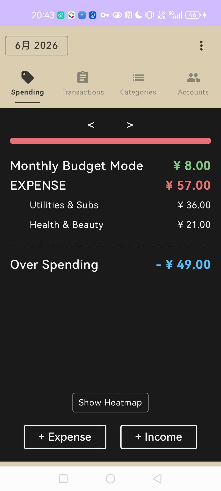
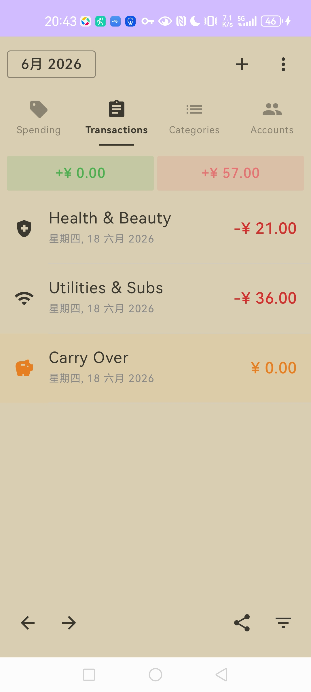
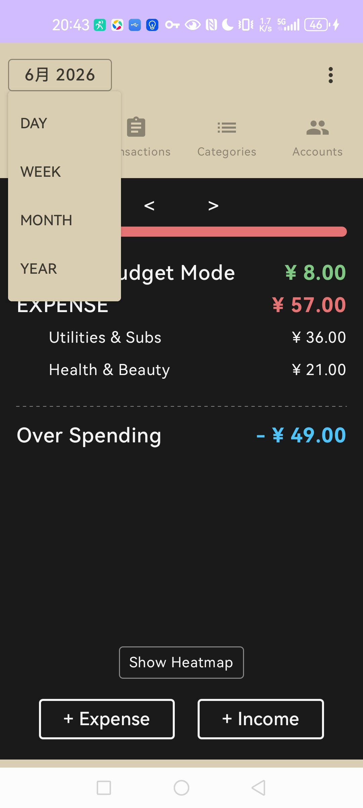
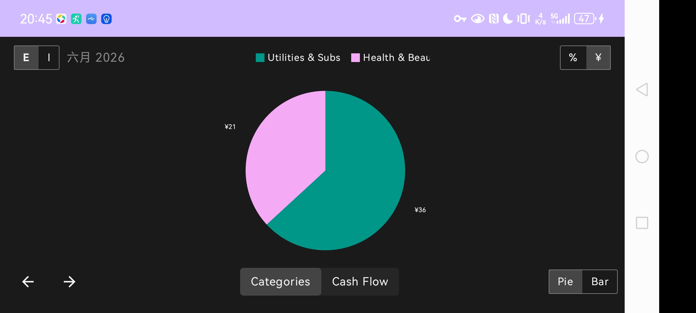
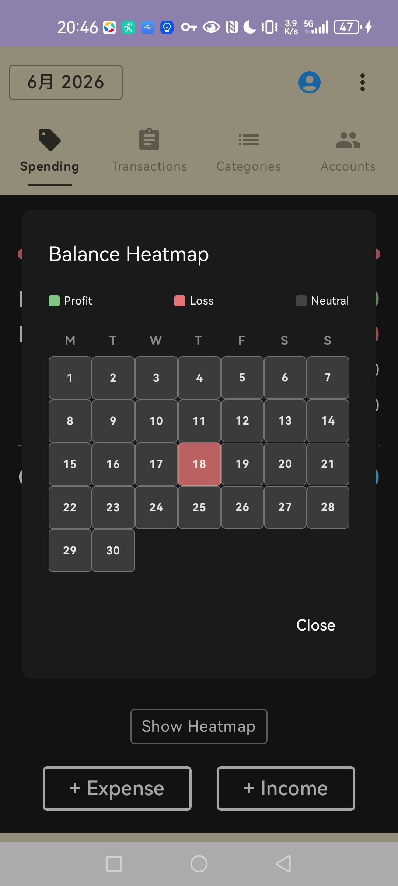
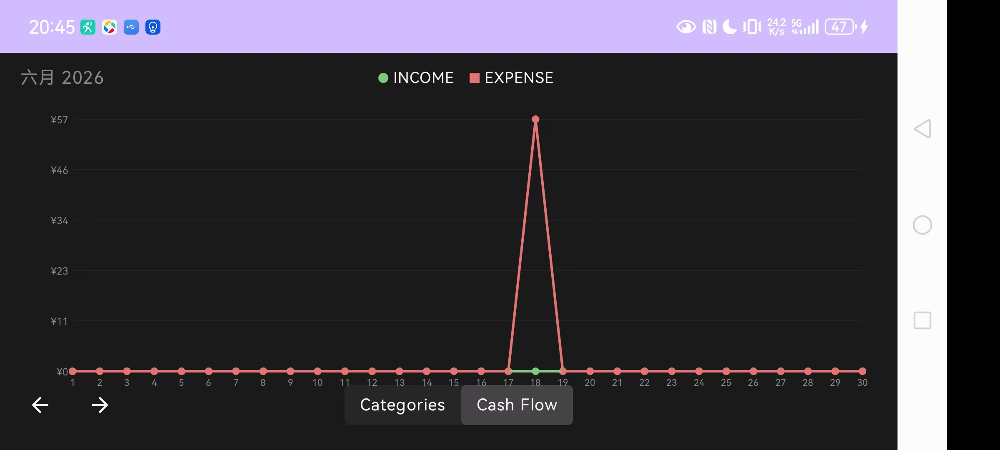
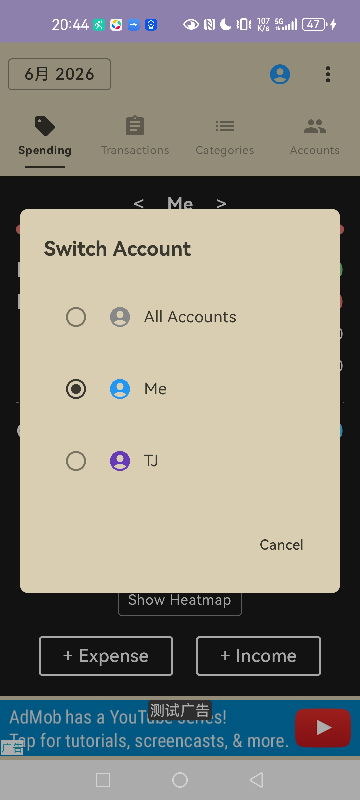
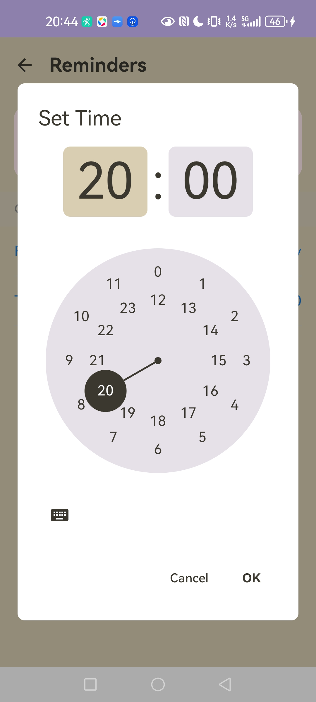
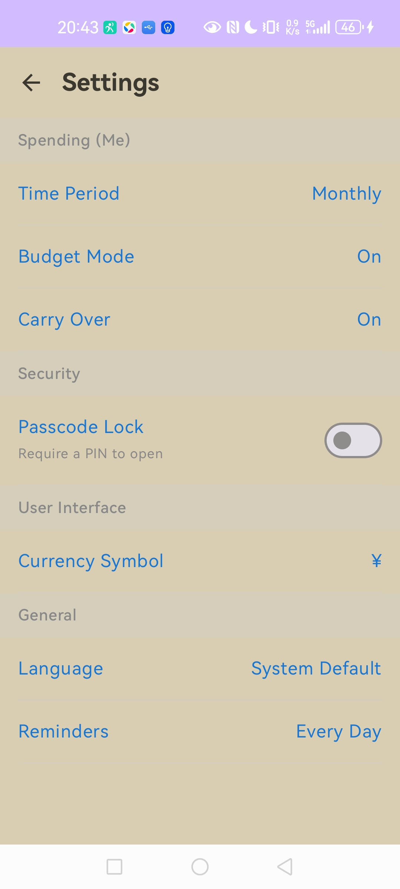

# 💰 Money Tracker

A high-performance, secure, and modern personal finance management application for Android. Built with **Jetpack Compose**, **Clean Architecture**, and **Material 3**.

---

## 📱 Feature Showcase

### 📊 Dashboard & Core Activity
Manage your daily financial flow with an intuitive interface and filtered transaction views.

  
  
  

### 📈 Analytics & Financial Insights
Deep dive into your spending patterns with heatmaps, cashflow charts, and category breakdowns.

  
  
  

### ⚙️ User Profiles & Configuration
Multi-user support, smart reminders, and biometric security settings.

  
  
  

---

## 🏗 Technical Architecture

This project follows **Modern Android Development (MAD)** best practices:

*   **Architecture:** Clean Architecture with MVVM (Model-View-ViewModel).
*   **UI Layer:** 100% Jetpack Compose for a reactive and declarative interface.
*   **Persistence:** [Room 2.7.0-alpha11](https://developer.android.com/training/data-storage/room) with Paging 3 support for large dataset handling.
*   **Security:** Full database encryption via **SQLCipher** and biometric authentication.
*   **Concurrency:** Kotlin Coroutines & Flow for asynchronous data streams.
*   **Background Tasks:** WorkManager for reliable notification and sync scheduling.

---

## 🛠 Tech Stack

- **Language:** Kotlin 2.1.0
- **UI:** Compose BOM 2024.12.01 (Material 3)
- **Database:** Room + Paging 3
- **Security:** Biometric API + SQLCipher
- **Monetization:** Google AdMob Integration
- **Minimum SDK:** API 24+ (Targeting API 35)

---

## 🚀 Setup & Installation

### Prerequisites
- Android Studio **Ladybug** (or newer).
- JDK **17**.
- Android SDK **35**.

### Installation
1. Clone the repository:
   
